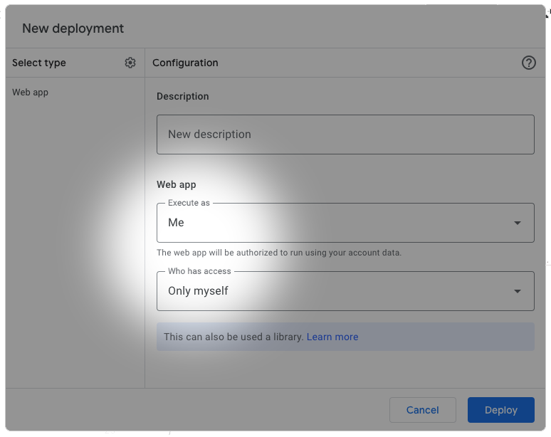
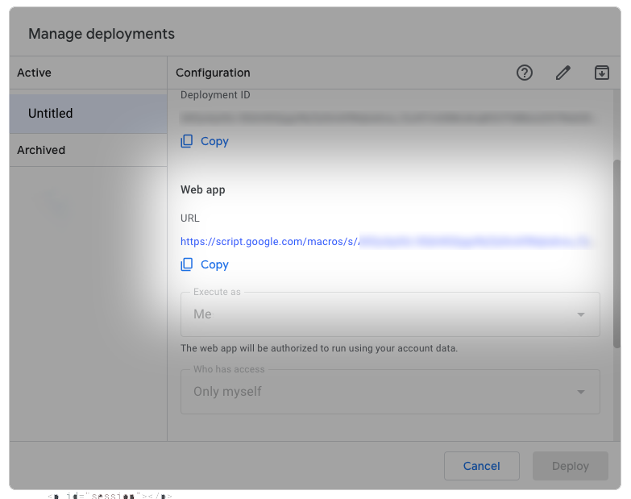
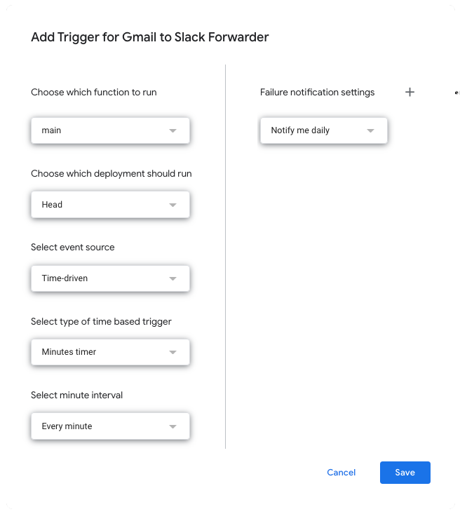

<div align="center">
  <h1>:email: Gmail to Chat Forwarder</h1>
  
  <a href="https://codeclimate.com/github/nandenjin/gmail-to-slack" target="_blank" rel="noopener noreferrer"></a>
  <a href="https://app.codecov.io/gh/nandenjin/gmail-to-slack" target="_blank" rel="noopener noreferrer"></a>
  
</div>

## What's this

Forward emails from Gmail to any messaging platforms by using [Google Apps Script](https://developers.google.com/apps-script).

### Features

- Filter by "label" of Gmail (configurable automation by "filters")
- Supports Slack Incoming Webhook or Discord Webhook
- Web-based configuration UI

> [!NOTE] > **For users of paid plans:** You can use **channel email address**, which is an official built-in feature of Slack.

Actual behavior of this script is very simple:

1. Search threads with specified label from Gmail.
2. Forward it to Slack.
3. Remove the label from the thread.

for each time it is called.

## How to setup

### 1. Initialization of the package

Clone the repository and install dependencies.

```sh
# Clone repository
git clone https://github.com/nandenjin/gmail-to-slack.git
cd gmail-to-slack

# Install dependencies
npm install
```

### 2. Create script

Create a new project of Google Apps Script (GAS) by using [clasp](https://npmjs.com/package/@google/clasp)

```sh
# If needed
npx clasp login

# Create a project
npx clasp create --rootDir dist
```

...or setup manually with exist project.

```sh
cp .clasp.template.json  .clasp.json
```

```json
{
  "scriptId": "REPLACE_WITH_YOUR_PROJECT_ID",
  "rootDir": "dist"
}
```

### 3. Build, push and deploy

Build and push codes to project.

```sh
npm run build
npx clasp push
```

Open GAS web editor and [publish a deployment](https://developers.google.com/apps-script/concepts/deployments).

```sh
npx clasp open
```

**Make sure the script is available only for yourself(Execute as = Me, Who has access = Only myself)** or someone can get your configurations: list of your Gmail labels and Slack Webhook URL.



### 4. Configure with Web UI

Open the URL that be shown at deployment modal.



Select a label to use to flag emails to be forwarded, and set Slack Outcoming Webhook URL.

### 4. Configure trigger

Back to GAS web editor and [setup time-driven trigger](https://developers.google.com/apps-script/guides/triggers/installable#managing_triggers_manually) to function `main`.



All ready! Test the things by adding the label to some threads manually, and confirm that they will be forwarded to intended channel.

## Contribute

If you have any trouble or question, feel free to ask at discussion of GitHub. Opening issue or submitting PRs are also welcome.
